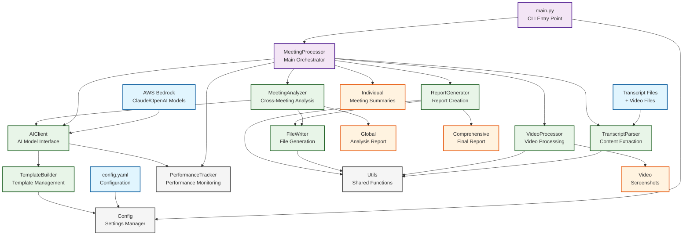
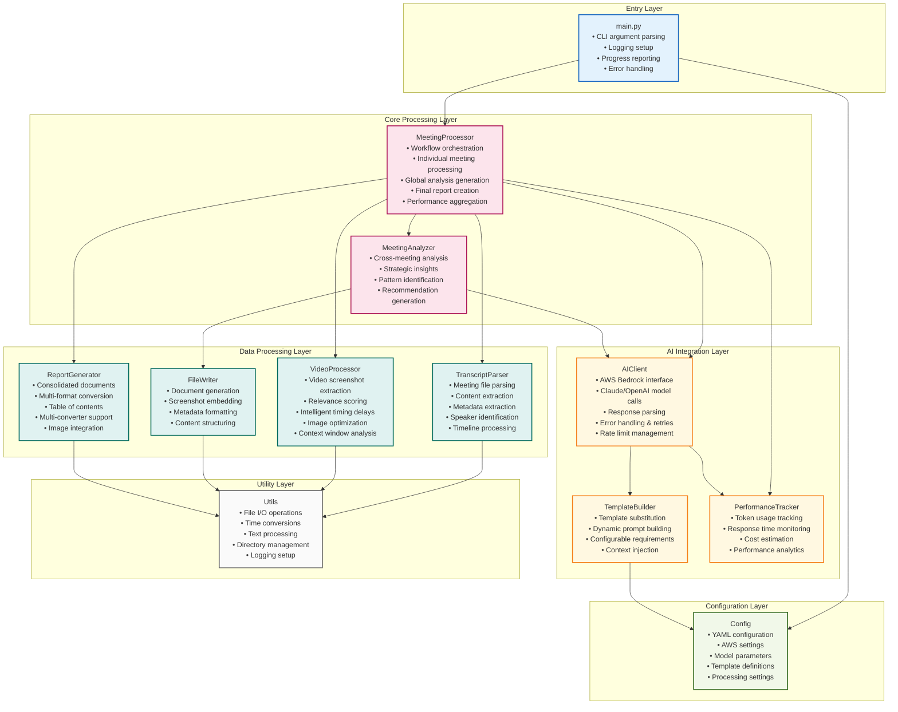
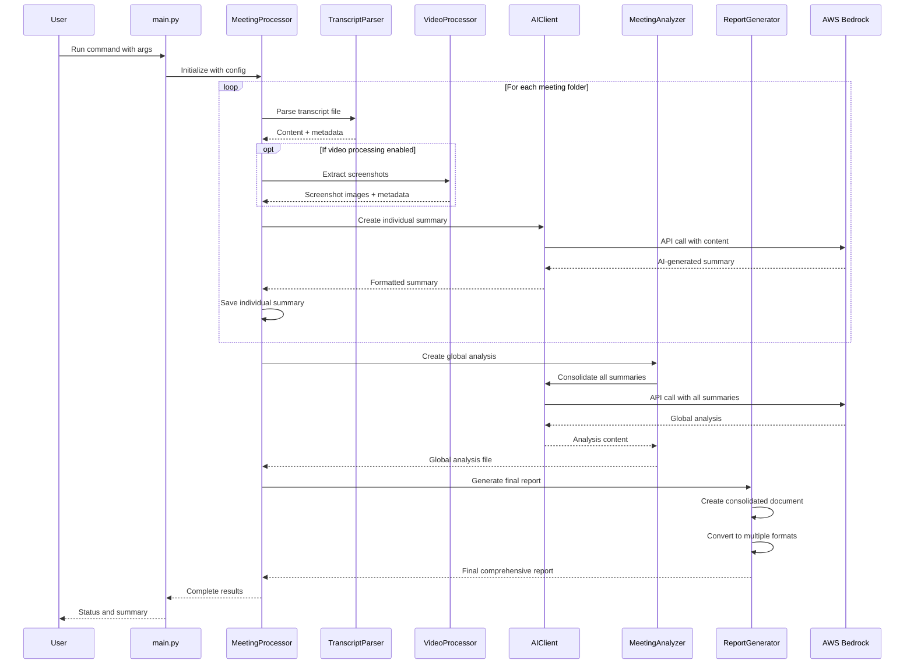
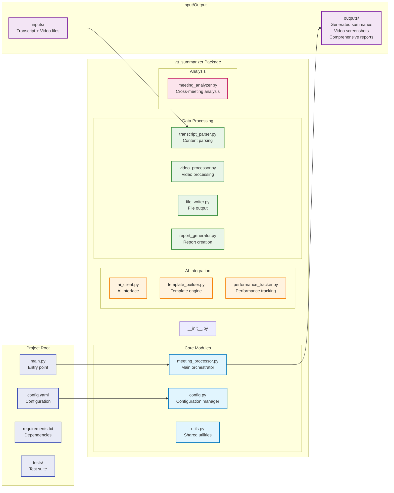

# Meeting Processor - System Architecture

This document provides a comprehensive architectural overview of the Meeting Processor application, which processes meeting recordings and transcript files to generate AI-powered summaries with video screenshot extraction and comprehensive reporting capabilities.

## High-Level Architecture Diagram

## Detailed Component Architecture

## Data Flow Architecture

## File Structure and Responsibilities

## Technology Stack

- **Language**: Python 3.8+
- **AI Models**: AWS Bedrock (Claude, OpenAI GPT models)
- **Video Processing**: OpenCV, PIL (Pillow)
- **Document Processing**: WebVTT-py, PyYAML
- **Report Generation**: Pandoc, WeasyPrint, or wkhtmltopdf
- **Configuration**: YAML-based configuration system
- **Dependencies Management**: pip with requirements.txt

## Key Design Patterns

1. **Orchestrator Pattern**: `MeetingProcessor` coordinates all processing steps
2. **Strategy Pattern**: Multiple report converters with fallback options
3. **Template Pattern**: Configurable prompt templates for different AI models
4. **Observer Pattern**: Performance tracking across all model calls
5. **Factory Pattern**: Dynamic model client creation based on configuration
6. **Chain of Responsibility**: Error handling with retries and fallbacks

## Naming Improvements Applied

### Key Changes Made:
- **ConsolidatedSummarizer** → **MeetingProcessor** (clearer main responsibility)
- **BedrockClient** → **AIClient** (less vendor-specific)
- **GlobalSummarizer** → **MeetingAnalyzer** (better describes cross-meeting analysis)
- **ModelStatisticsTracker** → **PerformanceTracker** (simpler, broader scope)
- **KeyframeExtractor** → **VideoProcessor** (broader video processing capabilities)
- **VTTParser** → **TranscriptParser** (less abbreviation-dependent)
- **SummaryWriter** → **FileWriter** (generic file operations)
- **PDFGenerator** → **ReportGenerator** (multi-format support)
- **PromptEngine** → **TemplateBuilder** (clearer template focus)

### Method Naming Improvements:
- **summarize_all()** → **process_meetings()** (clearer action)
- **_invoke_model_with_stats()** → **_call_ai_model()** (simpler)
- **generate_summary()** → **create_summary()** (more direct)
- **extract_keyframes()** → **extract_keyframes()** (kept, but context improved)

### Variable Naming Improvements:
- **vtt_folders** → **meeting_folders** (domain language)
- **keyframes** → **video_screenshots** (more descriptive)
- **global_summary** → **global_analysis** (better describes cross-meeting insights)
- **stats_tracker** → **performance_tracker** (clearer purpose)

## Benefits of New Naming Scheme

1. **Improved Readability**: Code intentions are clearer
2. **Domain Alignment**: Better matches business language
3. **Reduced Cognitive Load**: Less technical jargon
4. **Easier Onboarding**: New developers can understand purpose faster
5. **Better Maintainability**: Changes are easier to locate and understand
6. **Future-Proof**: Names accommodate potential feature expansions
