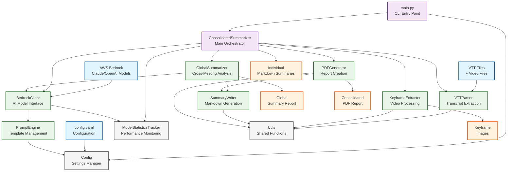
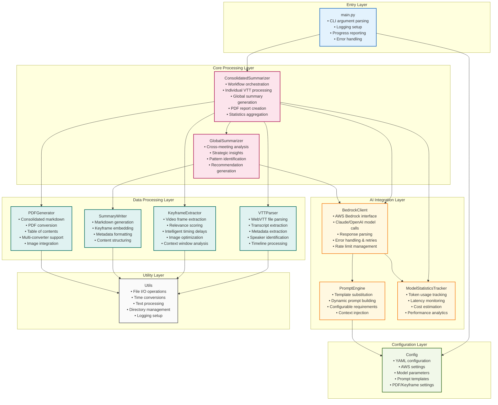
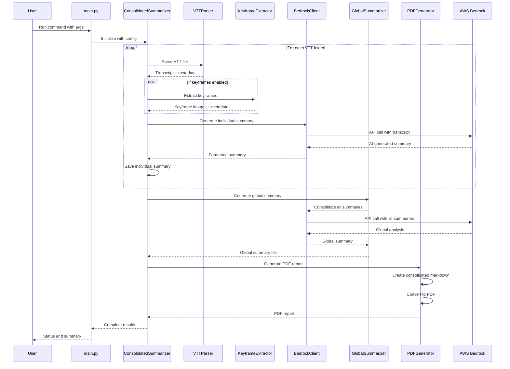
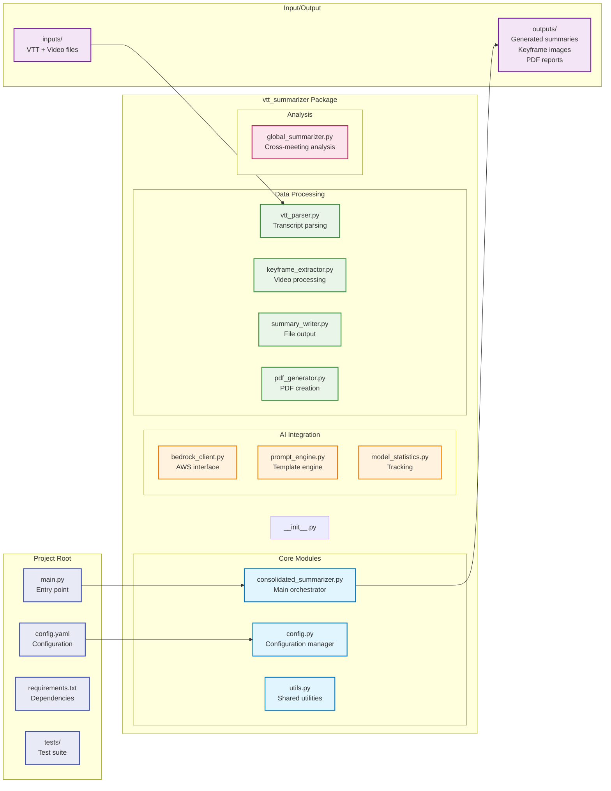

# VTT Summarizer - System Architecture

This document provides a comprehensive architectural overview of the VTT Summarizer application, which processes meeting recordings (VTT files) and generates AI-powered summaries with keyframe extraction and PDF reporting capabilities.

## High-Level Architecture Diagram

## Detailed Component Architecture

## Data Flow Architecture

## File Structure and Responsibilities

## Technology Stack

- **Language**: Python 3.8+
- **AI Models**: AWS Bedrock (Claude, OpenAI GPT models)
- **Video Processing**: OpenCV, PIL (Pillow)
- **Document Processing**: WebVTT-py, PyYAML
- **PDF Generation**: Pandoc, WeasyPrint, or wkhtmltopdf
- **Configuration**: YAML-based configuration system
- **Dependencies Management**: pip with requirements.txt

## Key Design Patterns

1. **Orchestrator Pattern**: `ConsolidatedSummarizer` coordinates all processing steps
2. **Strategy Pattern**: Multiple PDF converters with fallback options
3. **Template Pattern**: Configurable prompt templates for different AI models
4. **Observer Pattern**: Statistics tracking across all model calls
5. **Factory Pattern**: Dynamic model client creation based on configuration
6. **Chain of Responsibility**: Error handling with retries and fallbacks

## Scalability Considerations

- Configurable processing limits and timeouts
- Intelligent rate limiting for API calls
- Modular architecture allows easy component replacement
- Statistics tracking for performance monitoring
- Extensive error handling and recovery mechanisms
